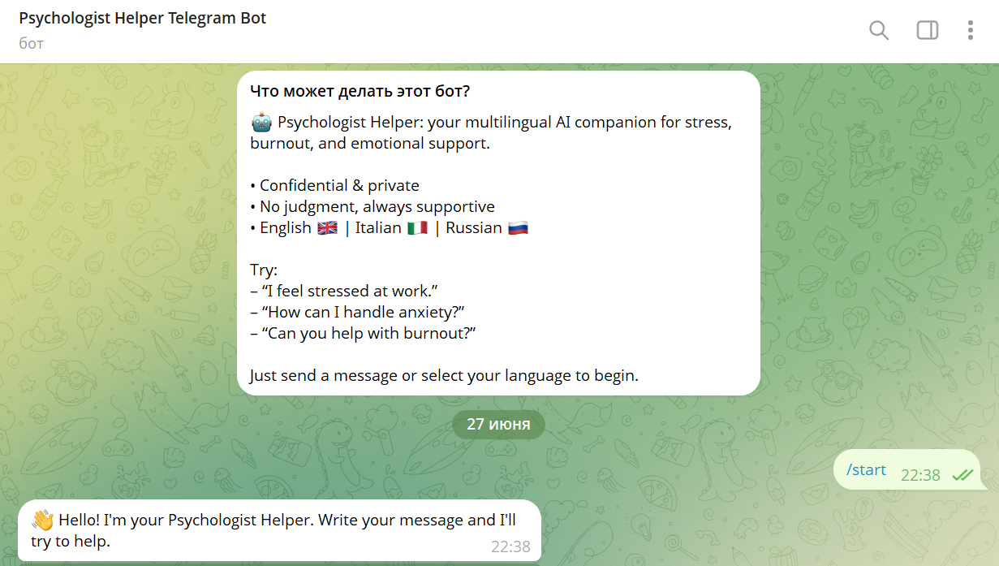
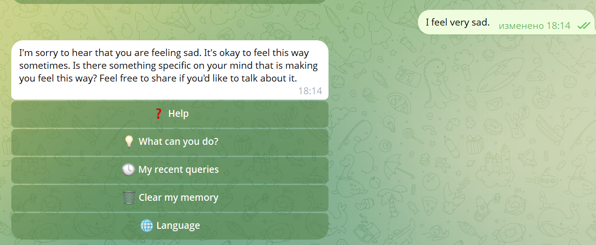
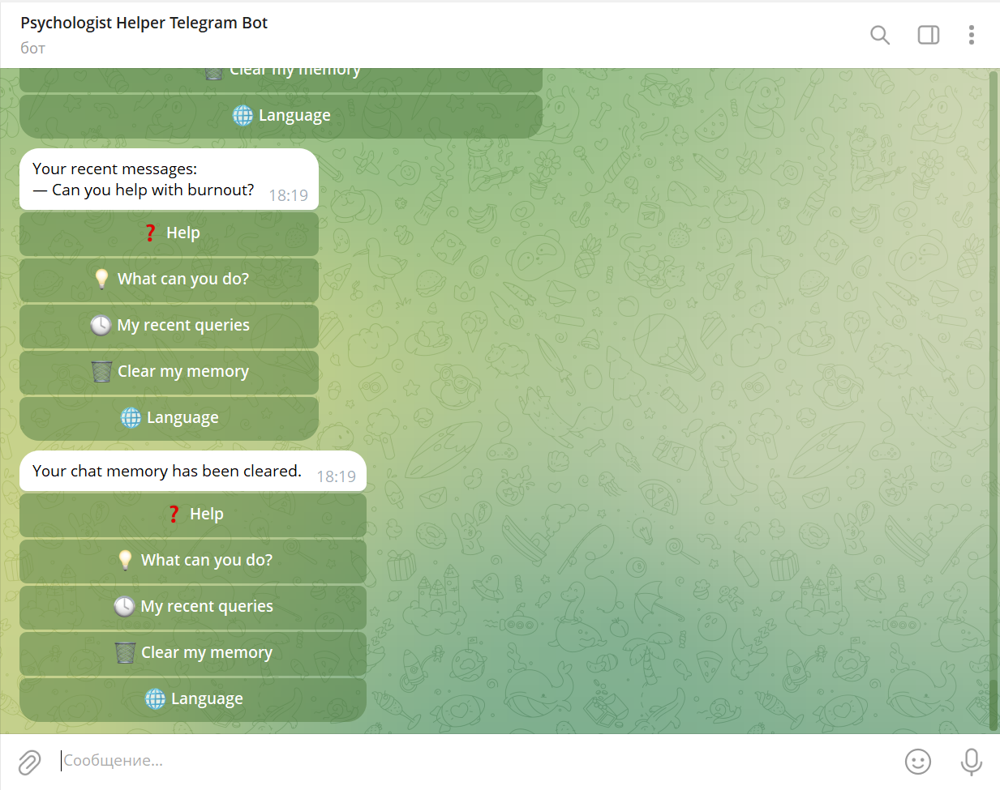

 Psychologist Telegram Bot 🤖🧠
 
The bot is available while my script is running. If you cannot get a response, please contact me to schedule a demo.

e-mail:margaritaviviers@gmail.com
Telegram: [@margii4](https://t.me/margii4)

Try the bot directly in Telegram: [@margii4_bot](https://t.me/margii4_bot)

An AI-powered Telegram bot that provides psychological support and friendly conversation in English, Italian, and Russian. The bot uses OpenAI GPT-3.5 for natural language processing, stores conversation context in Pinecone (vector database), and offers a multilingual, menu-driven user experience.

   Features

- ✨ Empathetic AI-powered support (never gives medical advice)
- 🌍 Multilingual: English, Italian, Russian (easily extendable)
- 🗂 Context-aware replies (remembers relevant user history)
- 🖱 Inline menu: Quick access to help, abilities, language switching, recent messages, and memory clearing
- 🔒 Secure: Uses environment variables for all secrets
- 🏃‍♂️ Async Python architecture: Fast and responsive

   Technologies Used

- Python 3
- OpenAI GPT-3.5 (API)
- Pinecone (vector database)
- python-telegram-bot
- python-dotenv
- Logging

    📸 Screenshots

| Welcome / Language | Empathetic Reply | Clear Memory |
|---|---|---|
|  |  |  |


 Getting Started

  1. Clone the repository

```bash
git clone https://github.com/Margii4/psychologist-bot.git
cd psychologist-bot
  ```
2. Install dependencies:
    ```bash
    pip install -r requirements.txt
    ```
3. Copy `.env.example` to `.env` and fill in your API keys:
    ```
    TELEGRAM_TOKEN=your-telegram-bot-token-here
    OPENAI_API_KEY=your-openai-api-key-here
    PINECONE_API_KEY=your-pinecone-api-key-here
    ADMIN_USER_ID=your-telegram-user-id-here
    ```
4. Run the bot:
    ```bash
    python psychologist_bot.py
    ```

## License

MIT
